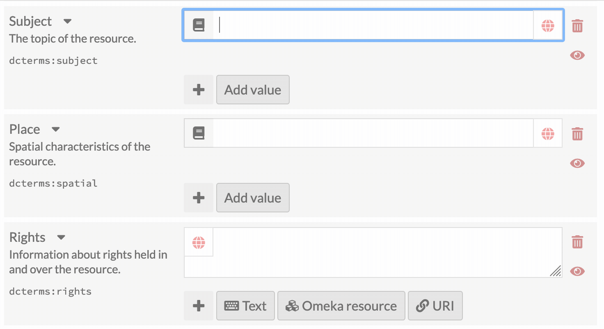
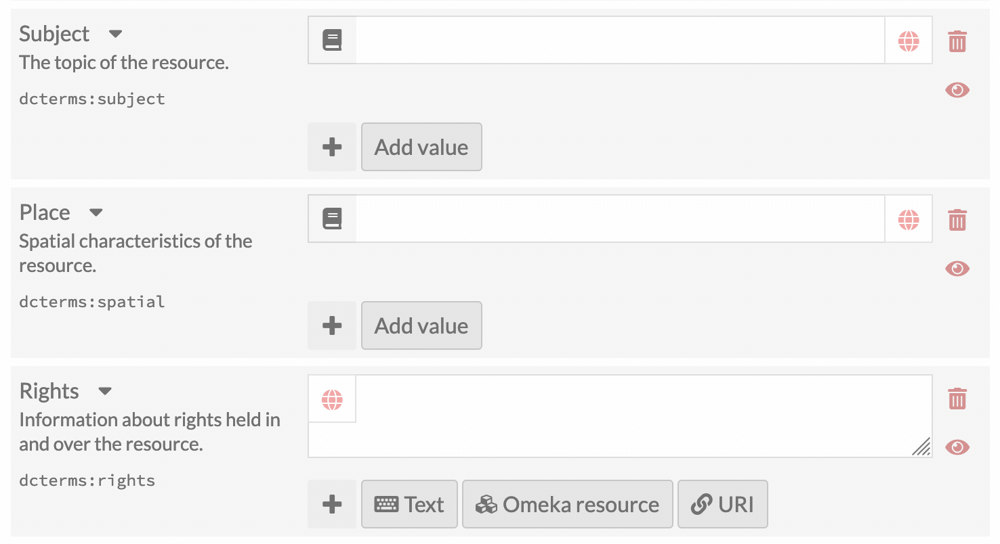

# Wikidata Module for Omeka-S

Auto-suggest Wikidata URIs and labels.

## Multilingual

Helps to retrieve labels in different languages

## Installation

Uncompress files from release zip or clone repository and rename module folder to `Wikidata`.
See general end user documentation for [Installing a module](http://omeka.org/s/docs/user-manual/modules/#installing-modules)

